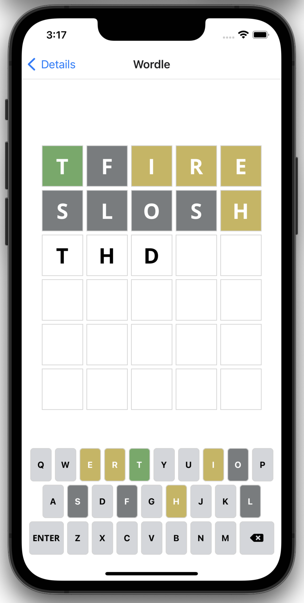

# Wordle clone

## To run the app with [Expo](https://docs.expo.dev/get-started/installation/)

### Install dependencies once

```
npm install --force
```

### Run the app

```
expo start
```

## Component Diagram


## Screenshots

